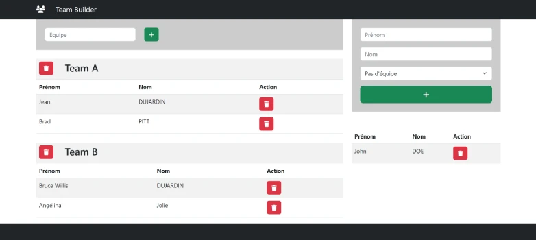

# TP 06 Team Builder
**live preview** :  
[Tester le TP Echo](https://www.sevenvalley.fr/tp-javascript/tpe) 



# TP Team Builder
Dans Real Time data Base
- créer un noeud personnes.json
- créer un noeud equipes.json

# Créer des components
<code>TrLigne.jsx</code> Appeler dans l' équipe et la liste des employés  
<code>TableEquipe.jsx</code> le composant Equipe    

# Créer les business object
- Personne.ts
- Equipe.ts

# Etapes
- ajouter une equipe
- supprimer une equipe  
- ajouter une personne dans une equipe
- ajouter une personne dans l'entreprise
- enlever une personne d'une equipe
- enlever la personne de l'entreprise


```js
const teams=
[
{
    name:'team A',
    users : [
      {id:1, name: "Alice", active: true },
      {id:2, name: "Bob", active: false },
      { id:3,name: "Charlie", active: true }
]},
   { 
    name:'team B',
    users : [
      { id:1,name: "Alice", active: true },
      { id:2,name: "Bob", active: false },
 
]},
];


const userId = 4;

const userTeams = teams.filter(team =>
  team.users.some(user => user.id === userId)
);

console.log(userTeams);
```