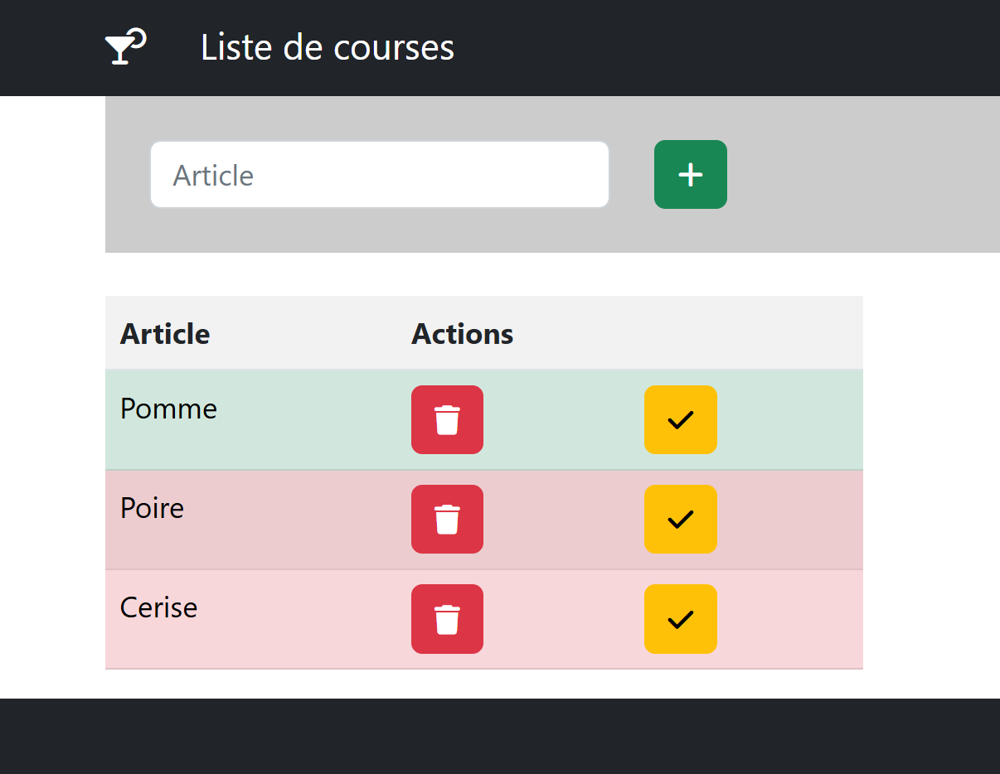

# TP 13 — Panier e-commerce avec <code>useContext</code>
## Objectif

Créer un panier partagé entre plusieurs composants.
-----------------------------------
Énoncé
---------------------------

Fonctionnalités :

ajouter un produit
afficher <b>le nombre d’articles</b>
afficher le <b>total</b> 

- CartContext.jsx
- Cart.jsx
- Product.jsx
- App.jsx

